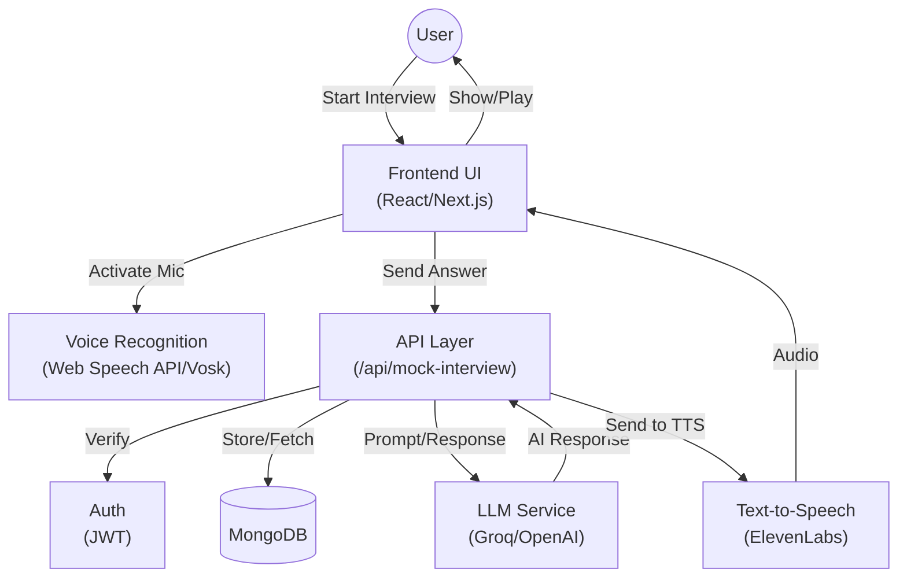
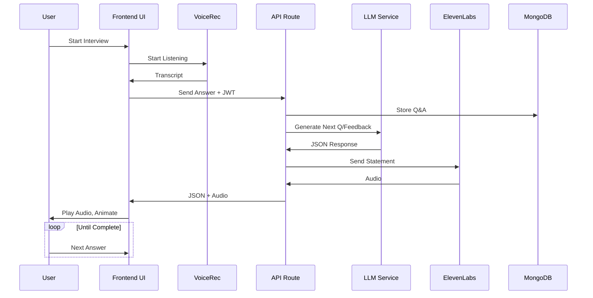
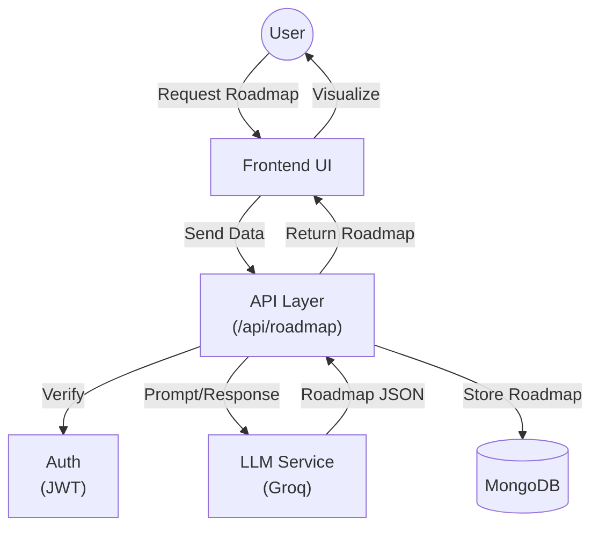
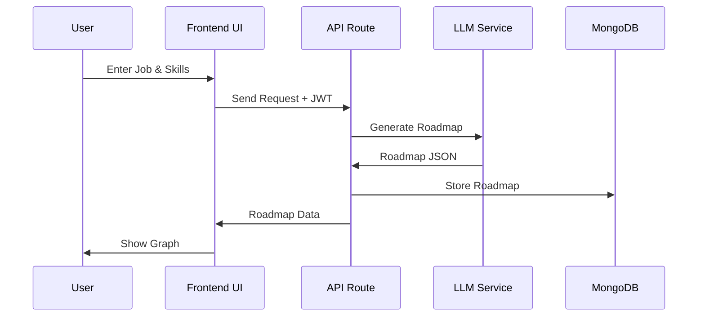
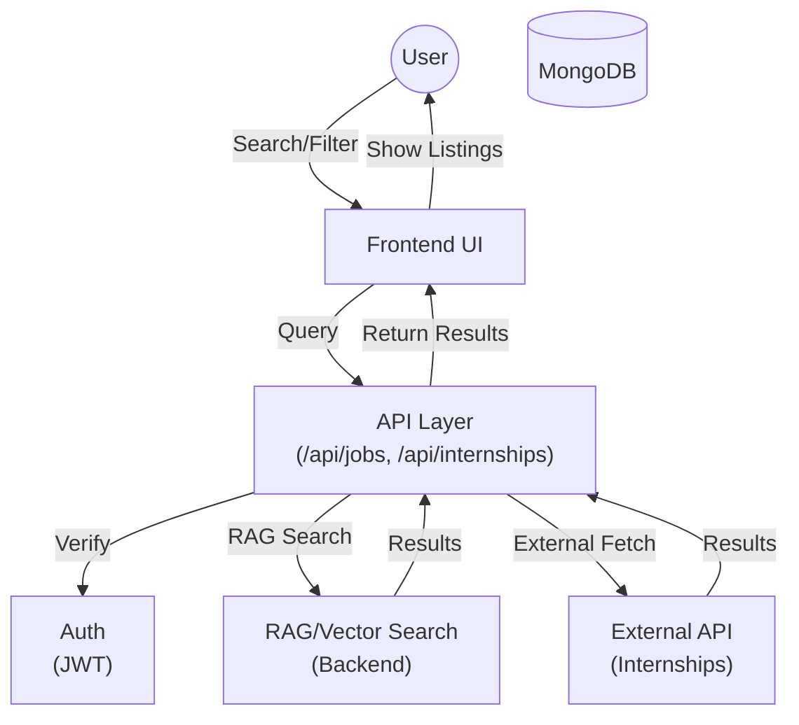
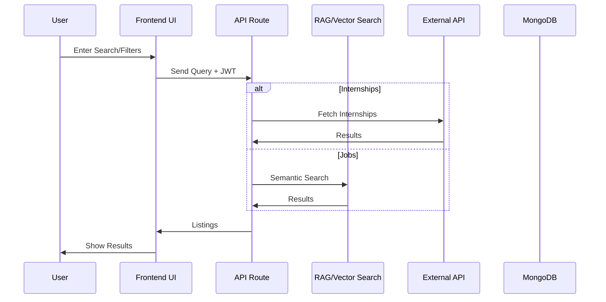
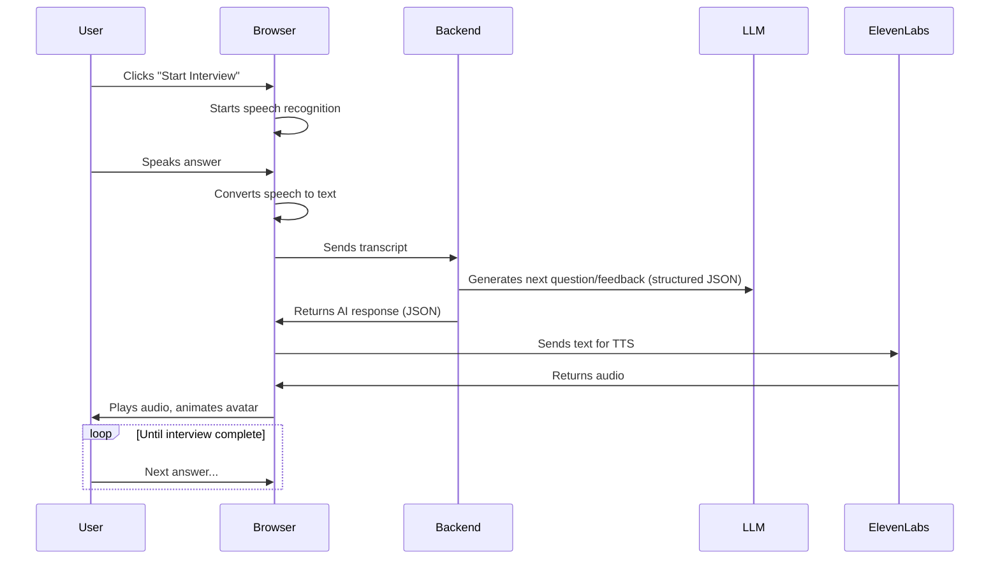

# Career AI – Features & Architecture

## Overview

Career AI is a Next.js-based career development platform offering AI-powered mock interviews, personalized career roadmaps, internship and job discovery (with semantic search), and more. The app leverages advanced AI (LLMs, RAG, ElevenLabs, Vosk, etc.) for a seamless, interactive user experience.

[Watch Career AI Demo](https://drive.google.com/file/d/1xxpx0jomSZttxzv5OyjHp2U80JvDlo4R/view)

## Architecture Diagrams (HLD & LLD)

### 1. Mock Interview – High Level Design (HLD)

### 1. Mock Interview – Low Level Design (LLD)

---

### 2. Career Roadmap – High Level Design (HLD)

### 2. Career Roadmap – Low Level Design (LLD)

---

### 3. Internships & Jobs – High Level Design (HLD)

### 3. Internships & Jobs – Low Level Design (LLD)

---

## Major Features

### 1. **AI-Powered Mock Interviews**

- **Create & Manage Interviews:** Users can create mock interviews by specifying job roles, skills, and difficulty. Interviews are stored per user.
- **Interview Flow:**
	1. **Start Interview:** User clicks "Start Interview".
	2. **Voice Input:** The app listens for the user's spoken answer using the Web Speech API or Vosk (offline).
	3. **Speech-to-Text:** Converts voice to text.
	4. **AI Processing:** Sends the transcript to the backend, which uses an LLM (with a structured prompt) to generate the next question or feedback.
	5. **Voice Output:** The AI’s response is sent to ElevenLabs for text-to-speech, and the audio is played back to the user.
	6. **Animations:** The AI interviewer avatar animates based on the context (talk, idle, clap, etc.).
	7. **Conversation Loop:** The process repeats until the interview is completed.
- **Feedback:** After each answer, the AI provides constructive feedback or follow-up questions.

### 2. **Career Roadmaps**

- **Personalized Generation:** Users can generate a career roadmap by entering their dream position and current skills.
- **AI-Driven:** The backend uses a prompt-based LLM (Groq) to generate a step-by-step roadmap, which is stored and visualized as nodes and edges (graph structure).
- **Search & Browse:** Users can search for existing roadmaps or view their own.
- **Visualization:** Roadmaps are displayed with milestones, resources, and links.

### 3. **Internships & Jobs (Semantic RAG Search)**

- **Internships:** Integrates with an external API to fetch and filter active internships. Users can search/filter by title, location, agency, etc.
- **Jobs:** (Assumed similar to internships) Uses semantic search and RAG (Retrieval-Augmented Generation) to fetch and rank job listings from the backend.
- **Filtering:** Users can search by keywords, location, company, etc.
- **Vector Search:** The backend likely uses vector embeddings to match user queries with job/internship descriptions for highly relevant results.

---

## Technical Architecture & Flows

### **Mock Interview Flow**

### **Career Roadmap Generation**

1. User enters dream job and skills.
2. Frontend sends data to `/api/roadmap`.
3. Backend crafts a prompt and calls Groq LLM.
4. LLM returns a structured roadmap (nodes/edges).
5. Roadmap is stored and visualized for the user.

### **Internship/Job Search**

- User enters search/filter criteria.
- Frontend builds API query and fetches results.
- For jobs, backend uses semantic vector search (RAG) to return best matches.

---

## Data Models

- **User:** Basic profile, email, password, etc.
- **MockInterview:** User, title, jobRole, skills, difficulty, notes, conversation (Q&A), status.
- **Roadmap:** Title, description, duration, nodes (steps), edges (connections).

---

## Additional Features

- **Dashboard:** Shows user progress, recent activities, skill tracking.
- **Offline Mode:** Uses Vosk for offline speech recognition.
- **Voice Assistant:** Context provider for managing voice input/output and conversation state.

---

## Extending & Customizing

- **AI Prompts:** Prompts for interviews and roadmaps are customizable in the `/lib` directory.
- **APIs:** All major features are exposed via RESTful endpoints under `/api`.
- **UI Components:** Modular, reusable components in `/components/ui`.
- **Authentication:** JWT-based authentication for secure user sessions.
- **Database:** MongoDB (via Mongoose) for persistent storage of users, interviews, and roadmaps.
- **Accessibility:** Voice input/output and keyboard navigation for inclusive UX.
- **PWA Support:** (If enabled) for offline access and installable experience.

---

## Detailed Feature Flows

### Mock Interview Flow (Step-by-Step)

1. **User initiates a mock interview** by filling out the form (role, skills, difficulty, notes).
2. **Interview session is created** and stored in the database, linked to the user.
3. **Interview UI loads** with an animated AI avatar and a "Start Interview" button.
4. **On start:**
	- The app activates the microphone and begins listening (Web Speech API or Vosk for offline).
	- User speaks their answer; speech is transcribed to text.
	- Transcript is sent to the backend API.
	- Backend uses a structured prompt (see `/lib/AI-InterviewerPrompt.js`) to generate the next question/feedback using an LLM.
	- The response is parsed (JSON: statement, animation, isCompleted).
	- The statement is sent to ElevenLabs for TTS; audio is played and avatar animates accordingly.
	- The conversation (Q&A) is appended to the interview record.
	- Loop continues until `isCompleted` is true.
5. **After completion:**
	- User can review the conversation, feedback, and optionally download a report.

### Career Roadmap Flow (Step-by-Step)

1. **User requests a roadmap** by entering their dream job and current skills.
2. **Frontend sends request** to `/api/roadmap` with user input.
3. **Backend crafts a prompt** (see `/lib/roadmapPrompt.js`) and calls Groq LLM.
4. **LLM returns a structured roadmap** (nodes: steps/milestones, edges: dependencies).
5. **Roadmap is saved** in MongoDB and returned to the frontend.
6. **Frontend visualizes the roadmap** as an interactive graph (with titles, descriptions, links).
7. **User can search, browse, and edit** their roadmaps.

### Internship & Job Search Flow (Step-by-Step)

1. **User navigates to internships or jobs section.**
2. **User enters search/filter criteria** (keywords, location, company, etc.).
3. **Frontend builds API query** and fetches results:
	- **Internships:** Calls external API (RapidAPI) and applies filters client-side.
	- **Jobs:** Sends query to backend, which uses semantic vector search (RAG) to retrieve and rank results.
4. **Results are displayed** with relevant details and links.
5. **User can save, apply, or further filter** listings.

---

## Additional Technical Details

- **Voice Recognition:** Uses Web Speech API for online, Vosk for offline (downloads model on demand).
- **Text-to-Speech:** ElevenLabs API for natural-sounding AI responses.
- **Error Handling:** Centralized error responses via `/lib/sendErrorResponse.js`.
- **User Context:** React Context API for managing user state and voice assistant state.
- **Reusable Hooks:** Custom hooks for fetch, speech recognition, and voice assistant logic.
- **Security:** API routes protected by JWT verification (`/lib/verifyToken.js`).
- **Analytics & Progress:** Dashboard aggregates user activity, skill progress, and recent actions.

---
